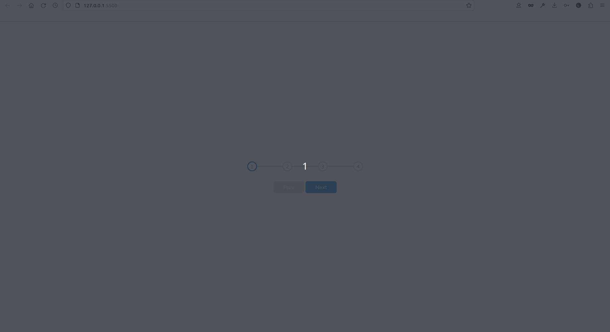

# progress-steps

## Information

Progress steps functionality

The project goal:

- Build a step
- use Flex to align everything
- add a JavaScript so that when the user click buttons, it change the class to active and then move to next step with a CSS transition
- using JavaScript for the event listeners
- using CSS transitions to give it the smooth through the effect

## Built With

[HTML5](https://www.w3schools.com/html/) / [CSS3](https://www.w3schools.com/css/) / [JavaScript](https://www.w3schools.com/js/)
